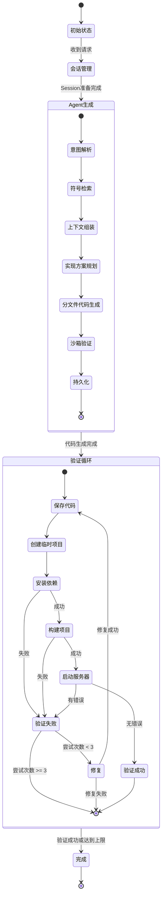

# 代码生成流程状态图

## 主状态机

```
┌─────────────────┐
│   初始状态       │
│  (Idle)         │
└────────┬────────┘
         │ 接收请求
         ▼
┌─────────────────┐
│  会话管理状态    │
│  (Session Mgmt) │
└────────┬────────┘
         │
         ├─ Session存在 → 使用现有Session
         └─ Session不存在 → 创建新Session
         │
         ▼
┌─────────────────┐
│  Agent生成状态   │
│  (Agent Gen)    │
└────────┬────────┘
         │
         ├─ 阶段1: 意图解析
         ├─ 阶段2: 符号检索
         ├─ 阶段3: 上下文组装
         ├─ 阶段4: 实现方案规划
         ├─ 阶段5: 分文件代码生成
         ├─ 阶段6: 沙箱验证（静态）
         └─ 阶段7: 持久化
         │
         ▼
┌─────────────────┐
│  验证循环状态    │
│  (Validation)    │
└────────┬────────┘
         │
         ├─ 尝试次数 < 3
         │   │
         │   ├─ 验证成功 ──────────────┐
         │   │                          │
         │   └─ 验证失败                │
         │       │                      │
         │       ▼                      │
         │   ┌──────────────┐          │
         │   │  修复状态     │          │
         │   │  (Fixing)    │          │
         │   └──────┬───────┘          │
         │          │                  │
         │          ├─ 修复成功 ────────┤
         │          │                  │
         │          └─ 修复失败 ────────┤
         │                             │
         └─ 尝试次数 >= 3 ──────────────┤
                                        │
                                        ▼
                              ┌─────────────────┐
                              │   完成状态       │
                              │  (Completed)    │
                              └─────────────────┘
```

## 详细状态转换

### 1. 主流程状态

```
[初始] 
  └─> [会话管理]
        └─> [Agent生成] (7个子状态)
              └─> [验证循环] (最多3次)
                    ├─> [修复] (如果失败)
                    └─> [完成]
```

### 2. Agent生成子状态机

```
[Agent生成开始]
  ├─> [意图解析] ──> [符号检索] ──> [上下文组装]
  │
  └─> [实现方案规划] ──> [分文件代码生成]
        │
        ├─> 文件1生成 ──> 文件2生成 ──> ... ──> 文件N生成
        │
        └─> [沙箱验证] ──> [持久化] ──> [Agent生成完成]
```

### 3. 验证循环状态机

```
[验证循环开始]
  │
  ├─> [保存代码]
  │     │
  │     └─> [创建临时项目]
  │           │
  │           ├─> [安装依赖]
  │           │     │
  │           │     ├─> 成功 ──> [构建项目]
  │           │     │             │
  │           │     │             ├─> 成功 ──> [启动服务器]
  │           │     │             │             │
  │           │     │             │             ├─> 成功 ──> [验证成功]
  │           │     │             │             │
  │           │     │             │             └─> 失败 ──> [验证失败]
  │           │     │             │
  │           │     │             └─> 失败 ──> [验证失败]
  │           │     │
  │           │     └─> 失败 ──> [验证失败]
  │           │
  │           └─> [验证失败]
  │                 │
  │                 ├─> 尝试次数 < 3 ──> [修复状态]
  │                 │                      │
  │                 │                      ├─> 修复成功 ──> [重新验证] (循环)
  │                 │                      │
  │                 │                      └─> 修复失败 ──> [验证失败]
  │                 │
  │                 └─> 尝试次数 >= 3 ──> [验证失败（最终）]
  │
  └─> [验证完成]
```

## 状态定义

### 主状态

| 状态 | 说明 | 进入条件 | 退出条件 |
|------|------|----------|----------|
| **初始** | 等待请求 | 系统启动 | 收到生成请求 |
| **会话管理** | 管理用户会话 | 收到请求 | Session准备完成 |
| **Agent生成** | 7阶段代码生成 | Session准备完成 | 代码生成完成 |
| **验证循环** | 后端验证和修复 | 代码生成完成 | 验证成功或达到最大次数 |
| **修复** | 自动修复代码 | 验证失败 | 修复完成 |
| **完成** | 流程结束 | 验证成功或达到最大次数 | 返回结果 |

### Agent生成子状态

| 状态 | 说明 | 顺序 |
|------|------|------|
| **意图解析** | 分析用户需求 | 1 |
| **符号检索** | 检索项目组件 | 2 |
| **上下文组装** | 组装项目上下文 | 3 |
| **实现方案规划** | 制定实现方案 | 4 |
| **分文件代码生成** | 逐个生成文件 | 5 |
| **沙箱验证** | 静态代码验证 | 6 |
| **持久化** | 保存文件和索引 | 7 |

### 验证子状态

| 状态 | 说明 | 条件 |
|------|------|------|
| **保存代码** | 保存到数据库 | 每次循环开始 |
| **创建临时项目** | 创建临时目录 | 保存完成 |
| **安装依赖** | npm install | 项目创建完成 |
| **构建项目** | npm run build | 依赖安装成功 |
| **启动服务器** | npm run dev | 构建成功 |
| **验证成功** | 所有步骤成功 | 服务器启动无错误 |
| **验证失败** | 任何步骤失败 | 检测到错误 |
| **修复** | 调用LLM修复 | 验证失败且未达上限 |
| **重新验证** | 重新开始验证 | 修复完成 |

## 状态转换表

### 主流程转换

| 当前状态 | 事件 | 下一状态 | 条件 |
|---------|------|---------|------|
| 初始 | 收到请求 | 会话管理 | 总是 |
| 会话管理 | Session准备完成 | Agent生成 | 总是 |
| Agent生成 | 代码生成完成 | 验证循环 | 总是 |
| 验证循环 | 验证成功 | 完成 | 验证通过 |
| 验证循环 | 验证失败 | 修复 | 尝试次数 < 3 |
| 验证循环 | 验证失败 | 完成 | 尝试次数 >= 3 |
| 修复 | 修复完成 | 验证循环 | 总是（重新验证） |

### 验证循环转换

| 当前状态 | 事件 | 下一状态 | 条件 |
|---------|------|---------|------|
| 保存代码 | 保存完成 | 创建临时项目 | 总是 |
| 创建临时项目 | 项目创建完成 | 安装依赖 | 总是 |
| 安装依赖 | 安装成功 | 构建项目 | 总是 |
| 安装依赖 | 安装失败 | 验证失败 | 总是 |
| 构建项目 | 构建成功 | 启动服务器 | 总是 |
| 构建项目 | 构建失败 | 验证失败 | 总是 |
| 启动服务器 | 启动成功 | 验证成功 | 无错误 |
| 启动服务器 | 启动失败 | 验证失败 | 检测到错误 |
| 验证失败 | 尝试次数 < 3 | 修复 | 总是 |
| 验证失败 | 尝试次数 >= 3 | 完成 | 总是 |
| 修复 | 修复成功 | 保存代码 | 重新开始循环 |
| 修复 | 修复失败 | 完成 | 总是 |

## 状态图（Mermaid格式）



## 关键状态说明

### 1. 验证循环状态（核心）

```
验证循环是一个有限状态机，最多执行3次：

第1次尝试:
  保存代码 → 创建项目 → 安装依赖 → 构建 → 启动服务器
  ├─ 成功 → 完成
  └─ 失败 → 修复 → 重新开始

第2次尝试:
  保存代码 → 创建项目 → 安装依赖 → 构建 → 启动服务器
  ├─ 成功 → 完成
  └─ 失败 → 修复 → 重新开始

第3次尝试:
  保存代码 → 创建项目 → 安装依赖 → 构建 → 启动服务器
  ├─ 成功 → 完成
  └─ 失败 → 完成（带错误信息）
```

### 2. 错误处理状态

```
错误可能发生在：
- Agent生成阶段 → 继续生成其他文件，不中断
- 验证阶段 → 触发修复流程
- 修复阶段 → 停止循环，返回当前代码

错误处理策略：
- 非致命错误：记录警告，继续执行
- 致命错误：停止流程，返回错误信息
```

## 状态持久化

### 保存的状态

- **Session状态**: 会话ID、用户ID、项目ID
- **生成进度**: 当前阶段、进度百分比
- **验证结果**: 验证状态、错误列表、尝试次数
- **代码内容**: 生成的文件、修复后的文件

### 状态恢复

- Session可以跨请求保持
- 进度信息保存在Session中
- 代码保存在数据库中
